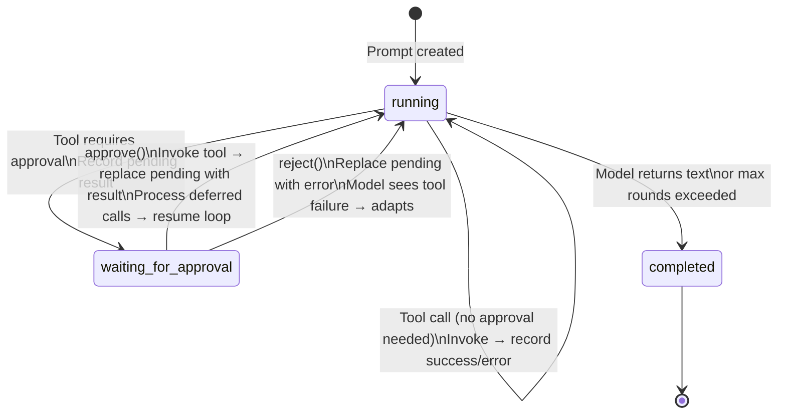
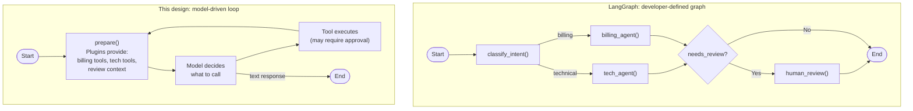

# Agent Loop Design

This document describes the agent loop architecture, its data model, and how it compares to LangGraph and direct LLM SDK usage.

## Design Goals

The agent loop solves a specific problem: **LLM APIs have a narrow output vocabulary** (text and tool calls), but agentic applications need richer output types — approval checkpoints, display widgets, file attachments, notifications. Rather than encode everything as text or tool results, this design introduces a **prompt-level output model** that is wider than what the LLM sees, with a translation layer that collapses it back to the LLM's message format.

The key principles:

- **One input, many outputs** — A prompt has one optional user input and an ordered array of typed outputs
- **Outputs are a superset of LLM capabilities** — The output array can contain types the LLM never produced (widgets, files, approval checkpoints)
- **Selective projection into LLM messages** — Only LLM-relevant outputs are included when building the next model call; the rest are display-only
- **Human-in-the-loop as a first-class state** — Approval is a tool result type (`pending`), not a separate workflow bolted on after the fact
- **Plugin-contributed tools and context** — The available tools and system context are rebuilt before every model call, enabling dynamic behaviour

## Data Model

### Prompt

A `Prompt` represents a single turn of agent execution — one user message triggering zero or more rounds of model calls and tool invocations.

```typescript
type Prompt = {
  id: string;
  userId: string;
  model: 'normal' | 'high';
  visible: boolean;
  state: 'running' | 'completed' | 'waiting_for_approval';
  input?: string;                  // Optional user message
  output: PromptOutput[];          // Ordered list of everything that happened
  usage?: PromptUsage;             // Token counts, cost
};
```

`input` is optional because prompts can be system-initiated (triggers, notifications, scheduled tasks) with no human message.

### PromptOutput — the discriminated union

Every output entry has a `type` field. The union is extensible — new types can be added without changing the agent loop:

| Type | Produced by | Sent to LLM? | Purpose |
|------|------------|---------------|---------|
| `text` | Model response | Yes (as `assistant` message) | The model's natural language output |
| `tool` | Tool invocation | Yes (as `function_call` + `function_call_output`) | Tool call with input, result, and timing |
| `file` | Tool (via `addFileOutput`) | Yes (as text summary) | File artifacts sent to the user |
| `widget` (spec 007) | Tool (via `displayWidget`) | **No** | Rich display data for the UI layer |

This is the core insight: **the output array is the canonical record of what happened**, and `promptsToMessages()` is a lossy projection that extracts only what the model needs to see.


### Tool results — three states

A tool output's `result` is itself a discriminated union:

```typescript
type PromptOutputToolResult =
  | { type: 'success'; output: unknown }
  | { type: 'error'; error: unknown }
  | { type: 'pending'; reason: string };   // Waiting for human approval
```

The `pending` state is not a separate data structure — it lives in the same output array, in the same position where a success or error would be. When the user approves, the result is updated in place to `success` or `error`. This means the prompt's output array is a complete, ordered timeline of the agent's execution, including pauses.

### Conversation

A `Conversation` is a sequence of prompts. It holds references to prompt IDs (not copies), a per-plugin state record, and a user association. The conversation passes all prior prompts as `history` when creating a new prompt, giving the model full multi-turn context.


The conversation passes all prior prompts as `history` when creating a new prompt. `promptsToMessages()` flattens them — for each prior prompt, the `input` becomes a `user` message and the outputs are projected into LLM message types (skipping widgets and display-only entries).

## The Agent Loop

`PromptCompletion.run()` implements a **prepare → call → process** loop:


### Prepare phase

Every loop iteration rebuilds the tool set and system context from scratch by calling `prepare()` on all registered plugins. Plugins can:

- **Add tools** based on conversation state (e.g., activate/deactivate skill tools)
- **Add context items** (system instructions) based on what happened so far
- **Read and write state** to coordinate across plugins

This means the model's capabilities change dynamically during execution. A tool activated in round 1 becomes available in round 2's prepare phase.


### Message projection

`promptsToMessages()` converts the rich output array into the subset the LLM understands:

```typescript
for (const output of prompt.output) {
  if (output.type === 'widget') continue;          // Skip — display only
  if (output.type === 'text')   → assistant message
  if (output.type === 'file')   → assistant message (text summary)
  if (output.type === 'tool')   → function_call + function_call_output pair
}
```

Widget outputs, file metadata, and any future display-only types are invisible to the model. The model already has the tool's return value through the normal function call output — the widget is a parallel channel for the user.

### Tool invocation

Tools receive a `ToolInput` with everything they need:

```typescript
type ToolInput<TInput> = {
  userId: string;
  input: z.input<TInput>;           // Zod-validated arguments
  state: State;                      // Read/write per-plugin state
  services: Services;                // DI container
  displayWidget?: (widget, data, fallback) => void;  // Emit display widgets
  addFileOutput: (file) => void;     // Emit file outputs
};
```

Tools can emit side-channel outputs (widgets, files) during invocation. These are collected and inserted into the output array immediately after the tool's own output entry.

## Human-in-the-Loop

### Approval as a tool result state

Any tool can declare `requireApproval` — either statically or as a function of the input:

```typescript
const dangerousTool = createTool({
  id: 'system.delete-data',
  requireApproval: { required: true, reason: 'This will permanently delete data.' },
  // ...
});

const conditionalTool = createTool({
  id: 'payment.send',
  requireApproval: async ({ input }) => ({
    required: input.amount > 100,
    reason: `Sending $${input.amount} requires approval.`,
  }),
  // ...
});
```

### What happens when approval is needed

1. The loop encounters a tool call that requires approval
2. Instead of invoking the tool, it records a `pending` result in the output array
3. The prompt state transitions to `waiting_for_approval`
4. A `prompt.approval-requested` event fires with the tool name, input, and reason
5. Any remaining tool calls in the same batch are deferred
6. The loop exits — the prompt is now paused

### Resumption

The external system (API, UI) calls `approve(toolCallId)` or `reject(toolCallId)`:

- **Approve**: The tool is invoked with the original input. The `pending` result is replaced with `success` or `error`. Deferred tool calls from the same batch are then processed. The loop resumes.
- **Reject**: The `pending` result is replaced with an `error` containing the rejection reason. The model sees this as a failed tool call and can adapt. The loop resumes.



This design means:
- The prompt output array is a complete audit trail including the pause
- The model receives the rejection as a normal tool error and can try a different approach
- No separate "approval queue" or "human task" abstraction is needed
- Multiple tools in a batch are handled correctly — approval blocks the batch, not just one call

## Advantages

### 1. Output types are extensible without changing the loop

Adding widgets (spec 007) required:
- A new variant in the `PromptOutput` union
- A one-line skip in `promptsToMessages()`
- A callback on `ToolInput`

The agent loop itself (`run()`) was unchanged. The same pattern works for any future output type — annotations, structured citations, progress indicators. The loop doesn't need to know about them.

### 2. The output array is the single source of truth

Every text response, tool call, tool result, file, widget, and approval pause is recorded in order in one array. This makes:
- **Persistence** trivial — serialise the array as JSON
- **Replay** possible — iterate the array to reconstruct what happened
- **Streaming** straightforward — publish events as new entries are appended
- **Debugging** easy — the array is a complete timeline

### 3. Human-in-the-loop is not a separate system

Approval is a tool result state, not a workflow engine feature. This means:
- Tools opt into approval with a single property
- The model sees rejections as tool errors and can recover
- The same data model handles both automated and human-gated execution
- No separate state machine or task queue for approvals

### 4. Dynamic tool and context assembly

Because `prepare()` runs every iteration, plugins can change what the model can do based on what has happened so far. Skills can be activated mid-conversation. Context can be added or removed based on state. This enables progressive disclosure — start with a small tool set and expand as the conversation develops.

### 5. Clean separation between model protocol and application protocol

The application thinks in `PromptOutput[]` (rich, extensible). The model thinks in OpenAI messages (constrained). The translation layer (`promptsToMessages`) bridges the two. This means you can:
- Switch LLM providers by changing only the message projection
- Add application-level output types without touching the LLM integration
- Store and display the full application-level record, not just what the model saw

## Comparison with LangGraph

[LangGraph](https://github.com/langchain-ai/langgraph) models agent execution as a **state machine graph** where nodes are functions and edges are conditional transitions. Here is how the two approaches differ:

### Execution model

| | This design | LangGraph |
|---|---|---|
| **Structure** | Linear loop with dynamic tool/context assembly per iteration | Explicit graph of nodes and edges |
| **Control flow** | Implicit — the model decides by choosing tool calls or text | Explicit — developer defines edges, conditions, and routing |
| **Adding capabilities** | Register a plugin; it contributes tools during `prepare()` | Add nodes, define edges, update routing logic |
| **Parallelism** | Model requests parallel tool calls; loop executes them | Graph defines parallel branches explicitly |

LangGraph's graph model gives fine-grained control over execution order, branching, and routing. This is powerful when you need deterministic workflows — "always do X before Y" or "route to sub-agent A vs B based on classification". The cost is that the control flow logic lives in graph definitions rather than in the model's reasoning.

This design takes the opposite stance: **the model is the router**. The loop provides tools and context; the model decides what to call and in what order. Adding a new capability is adding a plugin, not redesigning the graph. This is simpler for open-ended agents where you want the model to figure out the plan, but less suitable for rigid multi-step workflows.



### Data model

| | This design | LangGraph |
|---|---|---|
| **State** | Typed per-plugin state + ordered output array | Single shared `State` dict passed through graph |
| **Output types** | Discriminated union, extensible beyond LLM capabilities | Whatever you put in state; no built-in output abstraction |
| **History** | Output array is the canonical record | State accumulates as graph executes; checkpointing for history |
| **Human-in-the-loop** | Tool result state (`pending` → `success`/`error`) | `interrupt()` + `Command(resume=...)` — graph-level concept |

LangGraph's state is a single mutable dictionary that flows through the graph. This is flexible but unstructured — you decide what goes in it. There is no built-in distinction between "what the model sees" and "what the application tracks".

This design's output array provides that distinction. The array contains everything (including types the model never sees), and `promptsToMessages()` selects what to send. This makes the output array a richer record than what any single LLM interaction contains.

### Human-in-the-loop

LangGraph uses `interrupt()` to pause graph execution at a node. Resumption is done with `Command(resume=value)`, which injects a value into the interrupted node. This is a graph-level primitive — powerful and general, but it means approval logic is part of the graph topology.

This design embeds approval in the tool system. A tool declares `requireApproval`; the loop handles the pause and resume. The model sees rejection as a tool error. No graph redesign needed to add approval to a tool — it is a property, not a node.

### When to prefer which

**Prefer this design when:**
- The agent is open-ended and the model should decide the execution plan
- You want to add capabilities (tools, plugins) without redesigning control flow
- You need rich output types beyond text and tool calls (widgets, files, approvals)
- Human-in-the-loop is per-tool, not per-workflow-step
- You want a simple, auditable output timeline

**Prefer LangGraph when:**
- You need deterministic multi-step workflows with explicit routing
- You want to compose sub-agents with defined handoff protocols
- The execution graph is the primary abstraction (not the tool set)
- You need graph-level features like time-travel debugging and branching

## Comparison with Direct LLM SDK (OpenAI)

Using the OpenAI SDK directly (or any LLM provider's SDK) means writing the loop yourself. Here is what this design adds on top:

### What you get from the SDK alone

The OpenAI Responses API gives you:
- Send messages, get back text or tool calls
- Parallel tool calls in a single response
- Structured function definitions with JSON Schema

### What you write yourself

With the raw SDK, you implement:

```typescript
// Minimal agent loop with OpenAI SDK
while (true) {
  const response = await openai.responses.create({ input: messages, tools });
  const toolCalls = response.output.filter(o => o.type === 'function_call');
  if (toolCalls.length === 0) break;

  for (const call of toolCalls) {
    const result = await invokeMyTool(call.name, JSON.parse(call.arguments));
    messages.push({ type: 'function_call', ...call });
    messages.push({ type: 'function_call_output', call_id: call.call_id, output: JSON.stringify(result) });
  }
}
```

This works. But every real application immediately needs:

| Concern | SDK-only approach | This design |
|---|---|---|
| **Input validation** | Manual JSON.parse + validation per tool | Zod schemas on tool definitions, validated automatically |
| **Error handling** | try/catch per tool, format error for model manually | Automatic — errors become `{ type: 'error' }` results fed back to model |
| **Approval / human-in-the-loop** | Build it yourself — pause loop, store state, resume | Built-in `requireApproval` on tools, `pending` result state, `approve()`/`reject()` API |
| **Dynamic tools** | Rebuild tool list manually each iteration | Plugins contribute tools during `prepare()` |
| **System context** | Hard-coded or manually assembled | Plugins contribute context items dynamically |
| **Output record** | You build your own storage format | `PromptOutput[]` — typed, ordered, serialisable |
| **Rich output types** | Encode in tool results or text | First-class output types (widgets, files) with LLM-invisible projection |
| **Token tracking** | Parse response metadata yourself | Automatic accumulation across rounds |
| **Streaming updates** | Build event system | Events fire for each new output entry |
| **State management** | Global variables or custom state object | Per-plugin typed state with Zod validation |
| **Multi-turn history** | Manually accumulate messages | Conversation holds prompt references; history passed automatically |

The raw SDK gives you the model call. This design gives you the agent lifecycle around it — preparation, execution, output recording, approval, and resumption — as a structured system rather than ad-hoc code.


### When to prefer which

**Prefer direct SDK when:**
- You need a simple, single-purpose agent with few tools
- You want full control over the message format and loop behaviour
- The overhead of a framework is not justified by the application's complexity
- You are experimenting or prototyping

**Prefer this design when:**
- You are building a platform where multiple teams add capabilities (plugins)
- You need human-in-the-loop approval on certain operations
- You want rich output types beyond text and tool results
- You need a consistent output record for persistence, streaming, and debugging
- The tool set and context change dynamically during execution
